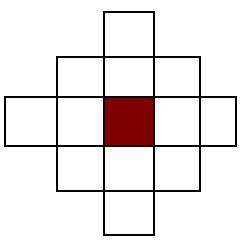
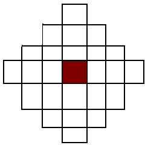
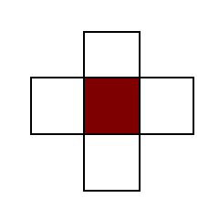

# Fantastic War  

*Os reinos estavam em properidade e harmonia, mas as antigas alianças ficaram abaladas quando um novo reino resolve ascender sobre os outros, gerando uma guerra por todos os lados buscando o monopólio de recursos e terras novos acordos foram feitos para garantir a vitória do melhor estrategista em campo*

## Condições de Vitória

Derrotar um comandante ou forte da equipe adversária

## Mecânicas

Cada jogador tem no seu turno pode realizar uma ação por unidade em campo, com algumas exceções as unidade podem atacar ou usar habilidades em movimento

### Turno

No início de cada turno o jogador deve:

* Coletar as taxas;
* Recupera um ponto de vida do seu comandante e do seu forte, até o máximo dele.

Cada unidade pode movimentar e realizar uma ação, exceto quando descrito ao contrário.

### Movimentação

Cada unidade pode movimentar ortogonalmente até a quantidade de espaços de sua movimentação, unidade inimigas e estruturas, como vilas, fortes ou murros, bloqueam movimentação, após a movimentação a unidade deve realizar sua ação ou declarar inação.

### Ataque

Ao escolher realizar um ataque

#### Ataque Curto Alcance

Ataques com distância 1 são considerados ataques de curto alcance

#### Ataque Longo Alcance

Ataques com distâncias maiores 1 são considerados ataques longo alcance, a distância é calculada da mesma maneira que a movimentação

### Contra-ataque

Todos os atacantes que estivem na área de ataque do alvo recebem um contra-ataque exceto quando o valor estiver zerado

### Ataque Favorável

Quanto um ataque é realizado contra uma unidade descrito como forte contra adiciona 50% no ataque arredondo para cima 

### Treinar

Com o máximo de 10 unidades por jogador, os quarteis podem treinar unidades que somente poderam agir no próximo turno

### Coletar Taxas

Para cada vila dominada gera uma moeda por início de turno, para tomar uma

### Habilidade de Comandantes

Com o custo de 5 moedas o comandante pode usar sua habilidade, uma força interna de sua nação invocada na área de combate

### Comandantes

Cada jogador conta com um comandante, o comandante é uma carta poderosa com 10 pontos de vida, é importante realizar sua defesa para evitar  

* Lord George  

*Educado desde cedo nas melhores escolas de guerra*
  
**Espaços de Movimento:** 5
**Espaços de Ataque:** 1
**Pontos de Vida:** 8
**Combate:* 7/2/5, 6/2/4, 6/2/3, 6/2/3, 4/2/3, 3/1/2, 3/1/2, 2/1/1
**Cor:** Azul  
**Habilidade:** Chuva Chumbo (Dano Massivo)

* Rainha Tereza

*Vinda de uma família com uma longa experiência de guerras, *
  
**Espaços de Movimento:** 5  
**Espaços de Ataque:** 1  
**Pontos de Vida:** 8  
**Combate:* 7/2/5, 6/2/4, 6/2/3, 6/2/3, 4/2/3, 3/1/2, 3/1/2, 2/1/1  
**Cor:** Amarelo  
**Habilidade:** Reforço de Ferro: todas as unidades aliadas distância de 3 recebem 1 ponto de vida como efeito de cura, até o máximo de pontos de vida
  
* Imperatriz Elizabete
  

  
*Sob seu comando possui um povo duro e lutador que escolheu Elizabete por refletir suas força, viver em companhia com o inverno pode ser difícil, mas ao domá-lo ganhou uma força que ajuda a limpar os campos de batalha*  

**Espaços de Movimento:** 5
**Espaços de Ataque:** 1
**Pontos de Vida:** 8
**Combate:* 7/2/5, 6/2/4, 6/2/3, 6/2/3, 4/2/3, 3/1/2, 3/1/2, 2/1/1
**Cor:** Branco  
**Habilidade:** General Inverno: realiza um ataque em área com a imperatriz no centro, todas as unidade inimigas em uma distância de 3 recebem dano como se divessem ditos atacados por Elizabete, mas sem direto de contra-ataque

* Rei Luis

*Vastos exercitos e uma ca*

**Espaços de Movimento:** 5
**Espaços de Ataque:** 1
**Pontos de Vida:** 8
**Combate:* 7/2/5, 6/2/4, 6/2/3, 6/2/3, 4/2/3, 3/1/2, 3/1/2, 2/1/1
**Cor:** Amarelo 
**Habilidade:** Carga: todas as unidades terão duas movimentações adicionais no turno, após o uso da habilidade

## Unidades

vasfvafsv

* Soldados  
Birdoj tie ĉi kantantaj
  * 3 Espaços de Movimento
  * 1 Espaços de Ataque
  * 3 Pontos de Vida
  * Forte contra Arqueiros
  * 3/1/1, 2/0/1, 1/0/1
  * 1 moeda

* Lanceiros  
Birdoj tie ĉi kantantaj
  * 5 Espaços de Movimento
  * 1 Espaços de Ataque
  * 2 Pontos de Vida  
  * Forte contra Cavaleiros
  * 3/0/2, 1/0/1
  * 2 moedas  
  
* Mosqueiros  
Birdoj tie ĉi kantantaj
  * 3 Espaços de Movimento
  * 3 Espaços de Ataque
  * 3 Pontos de Vida  
  * Forte contra Lanceiros
  * 3/0/2, 2/0/1, 1/0/0
  * 2 moedas
  
* Cavaleiros  
Birdoj tie ĉi kantantaj
  * 5 Espaços de Movimento
  * 1 Espaços de Ataque
  * 5 Pontos de Vida  
  * Forte contra Catapultas
  * 4/1/2, 3/1/2, 3/0/2, 2/0/1, 1/0/1
  * 3 moedas
  
* Canhão  
Movimento ou Ataque por turno  
  * 5 Espaços de Movimento
  * 4 Espaços de Ataque
  * 5 Pontos de Vida
  * Forte contra Soldados
  * 6/2/0, 4/2/0, 3/1/0, 2/1/0, 1/0/0
  * 6 moedas
  * **Condição:** Movimento ou Ataque por turno  

## Cartas

As cartas são usadas para consulta das estátisticas das unidades e para acompanhar sua saúde, ela é composta pela:
* Quantidade de Moedas para o treinamento
* Pontos de Vidas e condições
* Descrição de uma habilidade, se possuir
  
## Componentes

* Comandantes (um por facção) (4 cartas, 4 tokens)
  * Lord George (Azul)  
  * Rainha Tereza (Amarelo)  
  * Imperatriz Elizabeth (Branco)  
  * Rei Luis (Vermelho)  
* Unidades por Tipo (4 cartas, 4 tokens)
  * 4 Soldados por facção (16 cartas, 16 tokens)
  * 3 Cavaleiros por facção (12 cartas, 12 tokens)
  * 3 Arqueiros por facção (12 cartas, 12 tokens)
  * 3 Magos por facção (12 cartas, 12 tokens)
  * 2 Catapulta por facção (8 cartas, 8 tokens)
* 40 marcadores de vida (Roxo) (40 tokens)
* 10 Vilas por facção (40)
* 2 Quartel por facção (8)
* 4 Fortes (um por facção)

### Mapa

* Vilas Neutras
* Vilas Equipe
* Quartel
* Fortes (1 por jogador)

## Referências

[Unit Types - Wargroove](https://wargroovewiki.com/Unit_Types)
[Seven Years War - Wikipedia](https://en.wikipedia.org/wiki/Seven_Years'_War)  
[Characters - Valkirie Chronicles](https://valkyria.fandom.com/wiki/Category:Characters)